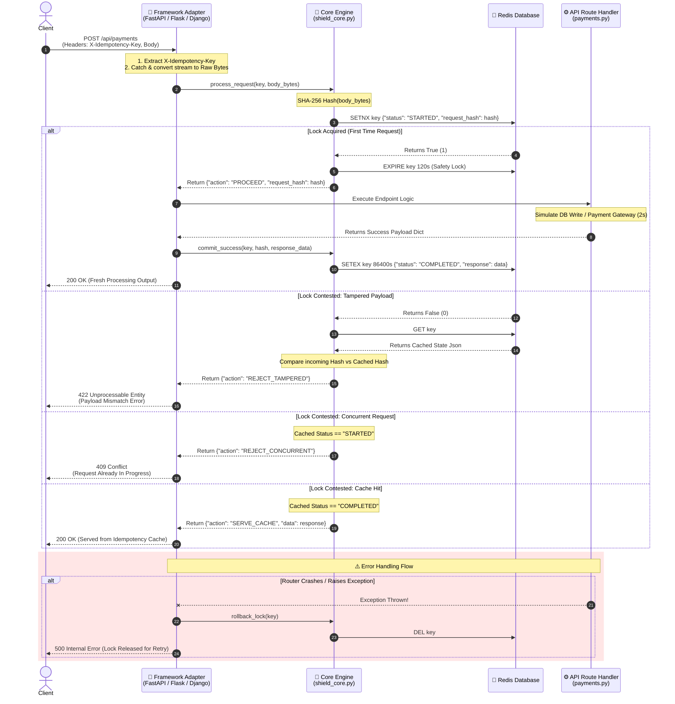

# Idempotency Middleware Engine

An idempotency middleware engine built with **FastAPI** and **Redis**. This system guarantees that identical API requests are processed safely exactly once—preventing double-charging in payment processing, eliminating distributed concurrent race conditions, and defending against payload hijacking.

## 🏗️ Architecture & Data Flow



The engine handles incoming `POST` requests by shifting tracking keys through an atomic lifecycle state machine inside Redis.

### The 3 States of an Idempotency Key
1. **`STARTED` (In-Flight Lock):** The first request is currently executing slow downstream code (e.g., a payment gateway). Concurrent duplicates are blocked.
2. **`COMPLETED` (Finalized Cache):** The transaction succeeded, and the final response payload is cached safely for 24 hours.
3. **`DELETED` (Auto-Recovery):** If the server crashes mid-execution or downstream services throw an error, the lock is automatically expunged so the client can try again.

---

##  Step-by-Step Code Walkthrough

The core system logic resides in `app/middleware/idempotency.py`. Here is how the engineering blocks operate under the hood:

### 1. Cryptographic Payload Fingerprinting
To prevent a client from reusing an old idempotency token to send different transaction parameters (e.g., shifting the cost from $10 to $999), we read the raw body bytes and compute a deterministic SHA-256 fingerprint:
```
body_bytes = await request.body()
request_hash = hashlib.sha256(body_bytes).hexdigest()
```

### 2. The Stream Rewind Solution
Because ASGI request bodies are network streams, reading the body consumes it. If left unhandled, your core routers would receive an empty body. We patch the private communication layer of the request object to reset the stream point:
```
async def receive():
    return {"type": "http.request", "body": body_bytes, "more_body": False}
request._receive = receive
```
### 3. Distributed Atomic Locking via Redis
To prevent race conditions, we utilize Redis's atomic setnx (Set if Not Exists) function. If two requests hit at the exact same millisecond, only one wins the boolean flag. We also apply an explicit 2-minute short TTL to prevent permanent deadlock conditions if the server loses power during processing:
```
initial_state = {"status": "STARTED", "request_hash": request_hash}
is_new_request = redis_client.setnx(idempotency_key, json.dumps(initial_state))
redis_client.expire(idempotency_key, 120)
```
### 4. Enforcement Guard Filters
If is_new_request is False, the middleware evaluates the existing tracking data inside Redis:

Payload Verification: If the computed hash doesn't match the historical cached hash, it raises an HTTP 422 Unprocessable Entity.

Concurrency Guard: If the state status is still "STARTED", it yields an HTTP 409 Conflict (notifying the caller that processing is already underway).

Happy Path Cache Hit: If the state is "COMPLETED", it breaks execution and surfaces the cached response data immediately with zero downstream impact.

---

## Step-by-Step Setup & Execution Guide

Follow these steps to configure your local machine and run the test suite.

Prerequisites
macOS / Linux terminal

Python 3.9+ installed

Docker Desktop installed and running

1. Project Initialization & Virtual Environment
Clone your directory layout, navigate into the root project directory, and initialize your isolated virtual ecosystem:
```
python3 -m venv venv
source venv/bin/activate
```
2. Launching Infrastructure (Docker Redis)
Ensure Docker Desktop is open. Spin up your isolated Redis backend container using Docker Compose:
```
docker compose up -d
```
3. Start the FastAPI Engine Server
With your virtual environment activated, install dependencies and start the Uvicorn runtime server window:
```
pip install fastapi uvicorn redis pydantic
uvicorn app.main:app --reload
```

---
## Simulation Testing
Open a new terminal window or tab (Cmd + T on macOS), change back to your directory path, and run the following curl operations

Test A: The Happy Path 
Send a fresh request tracking key.
```
curl -X POST [http://127.0.0.1:8000/api/v1/payments](http://127.0.0.1:8000/api/v1/payments) -H "Content-Type: application/json" -H "X-Idempotency-Key: master-key-01" -d '{"amount": 10.0}'
```
Result: System pauses for 2 seconds (simulating mock payment processing) and outputs a successful payment hash dictionary. Subsequent attempts with the exact same payload will return instantly from the Redis cache.

Test B: The Race Condition Double-Click Guard 
Trigger two identical payment executions simultaneously using bash background worker processing operators (&):
```
curl -X POST [http://127.0.0.1:8000/api/v1/payments](http://127.0.0.1:8000/api/v1/payments) -H "Content-Type: application/json" -H "X-Idempotency-Key: concurrent-key-02" -d '{"amount": 250.0}' & curl -X POST [http://127.0.0.1:8000/api/v1/payments](http://127.0.0.1:8000/api/v1/payments) -H "Content-Type: application/json" -H "X-Idempotency-Key: concurrent-key-02" -d '{"amount": 250.0}'
```
Result: One request enters processing for 2 seconds. The second overlapping duplicate request returns instantly with an HTTP 409 Conflict response block.

Test C: Payload Tampering & Hijacking Protection 
Initialize a valid receipt cache footprint for 50.0:
```
curl -X POST [http://127.0.0.1:8000/api/v1/payments](http://127.0.0.1:8000/api/v1/payments) -H "Content-Type: application/json" -H "X-Idempotency-Key: security-key-03" -d '{"amount": 50.0}'
```
Attempt to exploit that identical key to force an unvalidated transaction change to 5000.0:
```
curl -X POST [http://127.0.0.1:8000/api/v1/payments](http://127.0.0.1:8000/api/v1/payments) -H "Content-Type: application/json" -H "X-Idempotency-Key: security-key-03" -d '{"amount": 5000.0}'
```
Result: The system triggers a cryptographic mismatch flag, blocks execution, and surfaces:
```
{"error": "Idempotency Key Conflict: Request body does not match the original request."}
```

